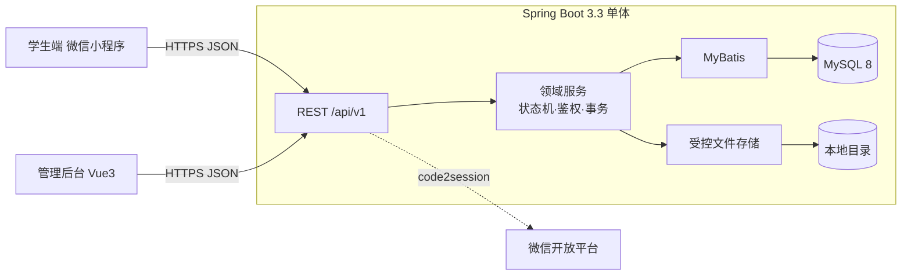

# 校园失物招领系统 · Campus Lost & Found System

面向校园失物招领场景的全栈系统，实现完整业务闭环：
**发布信息 → 搜索 / 规则匹配 → 提供线索或申请认领 → 核验 / 沟通 → 双向交接 → 归还 / 找回 → 争议与治理**。

> 三人软件工程课程项目（武汉理工大学）。学生端微信小程序 + Web 管理后台 + Spring Boot 单体后端。
> 核心业务已实现，支持真实 MySQL 回归验证；运行范围与外部验证条件见[测试报告](docs/testing/test-report.md)。

---

## ✨ 功能特性

| 模块 | 能力 |
|---|---|
| **M1 用户与身份** | 微信登录（code2session）、受限测试登录、管理员登录、JWT + 服务端会话（可撤销 logout / refresh）、资料编辑、校园身份"未认证"展示、`CampusIdentityProvider` 扩展点（本期 disabled） |
| **M2 后台治理** | 信息详情与治理历史、下架/恢复（保留原状态、关闭关联申请）、用户限制/解除、按对象检索审计日志、备份（图片目录 + 清单 + 校验和）、后台总览统计 |
| **M3 发布与浏览** | 发布/编辑/撤回 LOST 与 FOUND、有效申请后核心字段锁定、公开列表与详情、我的发布、安全图片上传（magic-byte 真类型校验 + 随机名 + 鉴权下载） |
| **M4 检索与匹配** | 组合筛选（关键词/类型/类别/校区/日期）、双向候选匹配、可解释评分 `S = 0.40C + 0.25L + 0.30T + 0.05K`、同分稳定排序 |
| **M5 认领与交接** | 提交/审核/撤销、**单活跃交接**（锁父发布 + 条件更新 + 生成列唯一索引）、双向确认、受控取消交接、完成后关联一条寻物帖 |
| **M6 沟通与争议** | 申请内私密留言、寻物线索反馈与处理、争议发起、管理员受理 + 裁决（继续 / 终止重开 / 关闭），私密证据分级鉴权 |

**安全红线**：所有权限由**后端逐资源强制**（不采信前端 `userId/role`）；私密证据无权访问统一 404；生产强制禁用测试登录并拒绝弱 JWT 密钥；规则匹配仅供参考，不证明物品归属；不接入真实校园认证。

---

## 🧱 技术栈

| 层 | 技术 |
|---|---|
| 学生端 | uni-app + Vue 3（构建目标：微信小程序），AppID 已接入 |
| 管理后台 | Vue 3 + Element Plus + Vite + Vue Router |
| 后端 | Spring Boot 3.3.5 · JDK 17 · MyBatis 3.0.3 · MySQL 8 · Flyway 10 · springdoc-openapi 2.6 · JWT(jjwt) · BCrypt |
| 测试/CI | JUnit 5 · MockMvc · maven-surefire/failsafe · Node.js 前端行为回归 · GitHub Actions |

## 🗂️ 目录结构

```text
campus-lost-found/
├── apps/
│   ├── miniapp/       # 学生端 uni-app / Vue3（微信小程序）
│   └── admin-web/     # 管理后台 Vue3 / Element Plus
├── server/            # Spring Boot 单体后端（edu.whut.clf.*）
├── db/                # migrations 说明 / seeds 演示数据
├── tests/
│   ├── e2e/           # e2e-smoke.sh 端到端冒烟脚本
│   └── frontend/      # 前端方法与请求行为回归
├── deploy/            # env.example / docker 预留
├── docs/              # 需求 / 架构 / API / 测试 / 运维 / 演示 / 贡献 / 阶段报告
└── .github/workflows/ # CI（后端 verify + 前端测试 + 两端 build）
```

## 🏛️ 架构概览



模块边界、跨模块事务所有者与状态机详见 [`docs/architecture/`](docs/architecture/)。

---

## 🚀 快速开始（开发环境）

**前置**：JDK 17 · Maven 3.9 · Node 24 · MySQL 8 · 微信开发者工具。

> ⚠️ 本机默认 `JAVA_HOME` 可能是 JDK 8，跑 Maven 前先切到 JDK 17，否则报 `class file version 61.0`：
> ```bash
> export JAVA_HOME="/c/Users/huangyx/.jdks/ms-17.0.18"
> ```

### 1) 数据库
```sql
CREATE DATABASE campus_lost_found DEFAULT CHARACTER SET utf8mb4;
CREATE DATABASE campus_lost_found_test DEFAULT CHARACTER SET utf8mb4;  -- 集成测试/隔离恢复库
```
> 或使用 Docker 一键起库（含两个库 + utf8mb4）：`docker compose -f deploy/docker-compose.dev.yml up -d mysql`

### 2) 配置
```bash
cp deploy/env.example deploy/.env     # 填 DB 账号密码、JWT_SECRET、管理员口令
# 微信机密放 server/src/main/resources/application-local.yml（均已 gitignore）
```

### 3) 后端
```bash
cd server
source ../deploy/.env
export DB_PASSWORD="$DB_PASSWORD"
mvn spring-boot:run                   # 端口 8080，前缀 /api/v1，Flyway 自动建表，dev 自动种子管理员
# 健康检查   GET http://localhost:8080/api/v1/health
# Swagger UI     http://localhost:8080/api/v1/swagger-ui/index.html
```

### 4) 管理后台
```bash
cd apps/admin-web && npm install && npm run dev    # http://localhost:5173
```

### 5) 学生端小程序
```bash
cd apps/miniapp && npm install && npm run dev:mp-weixin
# 用微信开发者工具导入 apps/miniapp/dist/dev/mp-weixin（"本地设置"勾选不校验合法域名以访问 localhost）
```

### 6) 演示数据（可选）
```bash
mysql -u <user> -p campus_lost_found < db/seeds/dev_seed.sql
```

---

## ✅ 测试

以下命令在 Git Bash 中运行，先将 `JAVA_HOME` 和 `PATH` 切换至 JDK 17，并在 `deploy/.env` 中配置数据库和管理员凭据。

```bash
# 仓库根目录：前端行为回归（无需启动服务）
node --test tests/frontend/regression.cjs

# 后端：单元测试与真实 MySQL 回归
cd server
source ../deploy/.env
export DB_PASSWORD="$DB_PASSWORD"
mvn test
CLF_IT=true DB_NAME="$DB_TEST_NAME" mvn verify
cd ..

# 端到端冒烟：先启动 dev 后端
BASE=http://localhost:8080/api/v1 ADMIN_USER="$ADMIN_BOOTSTRAP_USERNAME" ADMIN_PASS="$ADMIN_BOOTSTRAP_PASSWORD" \
  bash tests/e2e/e2e-smoke.sh

# 两端生产构建
(cd apps/admin-web && npm run build)
(cd apps/miniapp && npm run build:mp-weixin)
```

回归包含双向确认、单活跃交接、争议冻结与裁决、资源权限、输入校验、UTC 时间、文件清理、稳定分页和会话撤销。当前执行记录及测试数量见[测试报告](docs/testing/test-report.md)，匹配评估见 [match-eval](docs/testing/match-eval/)。

微信真机需配置合法 HTTPS 域名，并替换 `apps/miniapp/src/utils/config.js` 的生产域名占位符。数据库导出和隔离恢复由[离线运维脚本](docs/operations/backup-restore.md)完成，需在目标部署环境演练。已有性能测试记录不代表任意部署环境的性能保证。

### 生产部署

后端默认使用开发配置，**生产启动必须显式设置 `SPRING_PROFILES_ACTIVE=prod`**，禁止同时激活 dev/test/ci，禁用测试登录，并提供足够强的 `JWT_SECRET`。上传目录和备份目录应配置为独立持久化目录。生产关闭 Swagger。

接口时间统一使用 UTC，响应带 `Z`，含偏移的输入转换为 UTC；小程序日期按设备本地时间展示。已有数据库若包含历史无时区时间，升级前须核对来源时区，按[部署文档](docs/operations/deployment.md)处理。


---

## 📚 文档

| 文档 | 内容 |
|---|---|
| [SRS 需求规格](docs/requirements/SRS.md) | 六模块功能需求 + NFR + 验收 |
| [追踪矩阵](docs/requirements/traceability.md) | 需求→设计→API→代码→测试 全量追踪 |
| [架构总览](docs/architecture/overview.md) · [状态机](docs/architecture/state-machines.md) · [ER 图](docs/architecture/er-diagram.md) | 架构 / 竞态 / 数据模型 |
| [OpenAPI 契约](docs/api/openapi.yaml) · [错误码约定](docs/api/conventions.md) | 接口 |
| [部署](docs/operations/deployment.md) · [备份恢复](docs/operations/backup-restore.md) | 运维 |
| [演示脚本](docs/demo/demo-script.md) · [测试报告](docs/testing/test-report.md) | 演示 / 测试 |
| [阶段报告](docs/reports/) · [风险与决策](docs/risks-and-decisions.md) | 过程与决策 |

---

## 👥 分工（每人纵向负责两个模块）

| 成员 | 模块 |
|---|---|
| A | M1 用户与身份 · M2 后台治理与维护 |
| B | M3 发布与浏览 · M4 检索与匹配 |
| C | M5 认领与交接 · M6 沟通与争议 |

贡献记录见 [`docs/contributions/`](docs/contributions/)。

## 📝 说明
- 课程项目，仅用于教学。根目录 `campus-lost-and-found/` 为早期微信云开发原型遗留，不参与构建。
- 机密（微信 AppSecret、数据库密码、JWT 密钥）仅存于 gitignore 的本地文件，不入库。
