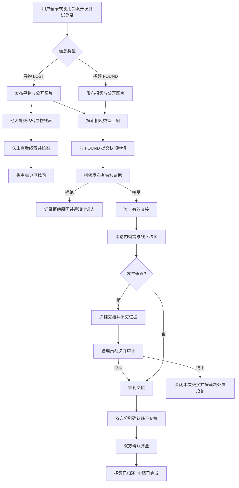

# 校园失物招领系统——Agent 全流程开发执行任务书

> **使用方式**：将本文件作为开发 Agent（Codex、OpenCode 等）的主任务书，放入仓库 `docs/AGENT_IMPLEMENTATION_PLAN.md`。Agent 应先检查现有仓库，再按阶段执行；不得因为任务书给出了建议目录而覆盖已有有效实现。  
> **项目属性**：三人软件工程课程项目；学生端微信小程序 + 简洁 Web 管理后台 + 单体后端。  
> **依据**：用户提供的《规划校园失物招领系统开发》完整对话记录。课程说明原始 PDF 未随本次请求单独提供；本任务书沿用对话中转述的课程要求，最终以教师正式要求为准。  
> **文档性质**：可直接执行的开发基线。标记为“**本期必做**”的功能应实现、测试并形成文档；标记为“**设计预留**”的部分不得冒充已集成；“**建议默认值**”可以在需求评审中修改，但修改后须更新代码、接口、测试和变更记录。

---

## 0. Agent 总指令与成功标准

你是本项目的全栈开发与软件工程执行 Agent。目标不是制作静态演示图或只写文档，而是交付**可运行、可测试、可复现、可用于三人课程验收**的校园失物招领系统；同时完整保留需求分析、架构设计、接口契约、数据库迁移、自动化测试、缺陷记录和个人贡献证据。

### 0.1 强制执行原则

1. **先审计现有仓库，再动手**。读取 README、目录、Git 状态、依赖、现有功能和测试；若为全新仓库才按本任务书初始化。不得删除已有业务数据、覆盖已有代码或无依据重构。
2. **全功能覆盖，按风险分阶段交付**。六个业务模块以及学生端、管理端、后端、数据库、文件服务、测试、文档均属于最终交付范围；阶段演示版可以暂时不齐全，但最终不能把某个“本期必做”功能仅用 TODO、假按钮或静态页面代替。
3. **需求—设计—实现—测试可追踪**。每项功能使用需求 ID；接口标注需求 ID；测试标注用例 ID；最终形成覆盖矩阵。
4. **真实校园认证本期不接入**。必须预留内部适配器和能力查询接口。未取得学校协议、授权和测试环境前，不臆造学校回调或声明已实现学校身份核验。
5. **微信登录与系统身份、校园身份分离**。真实微信登录只有在合法取得开发配置时启用；开发环境必须有受限的测试登录。任何自行填写的学号都不能视作学校认证。
6. **安全规则由后端强制执行**，不能仅靠前端隐藏。任何敏感认领证明、争议证据、个人信息和管理接口都须做服务端鉴权与资源级授权。
7. **不可用“智能匹配”代替认领核验**。本期采用可解释的规则匹配，供用户寻找线索，匹配结果不证明归属。
8. **不得伪造测试结果或课程贡献**。无法运行的真机测试、备份恢复、性能测试等必须如实标为“待验证”，附原因和执行方法；Agent 不能把其生成的代码虚报为某个同学已经独立完成。
9. **所有变更可回滚**。使用 Git 分支、数据库版本化迁移、测试数据与生产数据隔离；不得在真实环境执行破坏性重置或未备份迁移。
10. **执行到完成为止，不停在方案层**。每完成一阶段，运行相应检查，修复可修复的错误，更新文档并输出阶段报告；遇到外部凭据或平台限制，完成所有不依赖该限制的功能，并清晰记录阻塞点。

### 0.2 最终完成定义（Definition of Done）

只有同时满足以下条件才可标记最终完成：

- 学生端能完成：测试/微信登录、浏览和发布寻物/招领、上传图片、查询筛选、查看匹配、针对寻物提供线索、针对招领申请认领、查看审核结果、留言、双方确认交接、申请争议、查看个人记录和状态。
- 管理端能完成：独立管理员登录、信息治理、用户限制、争议处理、查看审计和执行/验证数据维护操作；没有越权入口或直接暴露私密证据。
- 后端能完成：安全认证、业务校验、事务并发约束、文件权限、匹配排序、审计、必要的查询与状态同步；接口文档与实际实现一致。
- 关键状态机、越权攻击、重复提交、并发审核、双向确认、争议暂停和隔离恢复测试通过。
- 项目有一键式**开发环境**启动方式、示例环境变量、迁移和种子数据、可复现演示脚本；真实发布所需平台条件单列，不把“本地可演示”写成“已公开上线”。
- 完成团队材料和三个角色、每人两个模块的独立工作证据模板；实际贡献待团队成员据实填写。

---

## 1. 项目背景、业务范围与产品形态

### 1.1 定位

面向校园失物招领场景，建立“**发布信息 → 搜索/匹配 → 提供线索或申请认领 → 核验/沟通 → 交接 → 归还/找回 → 争议与治理**”的完整闭环。

**寻物（LOST）**与**招领（FOUND）**必须区分：

- 寻物由失主发布，目的是获取线索或与匹配的招领信息建立联系；**不能直接对寻物信息提交‘认领申请’**。
- 招领由拾物者发布，目的是寻找失主；其他用户可申请认领，发布者审核证明，双方完成交接确认。
- 搜索与自动匹配在相反类型的**有效公开信息**之间进行；私密认领证明和争议资料永不参与公开匹配展示。

### 1.2 角色

| 角色 | 授权范围 | 说明 |
|---|---|---|
| 游客 | 浏览允许公开的招领/寻物信息、基础检索 | 不得提交线索、留言或认领；本期是否允许游客浏览属于建议默认值 |
| 普通用户 | 登录、编辑自己的资料/发布、搜索匹配、提供线索、申请认领、审核自己发布的招领、参与自己的交接与争议 | “发布者”和“认领者”是具体记录上的关系，而非永久账号角色 |
| 管理员 | 后台治理、被授权的争议处理、审计查阅及维护操作 | 权限由后端配置与记录范围控制，不允许前端自行提升 |
| 开发测试用户 | 仅在隔离开发/测试环境使用模拟登录 | 禁止在生产环境开启测试登录 |

**身份声明**：本期登录能证明用户持有当前系统登录态，**不能证明其为武汉理工大学在校师生**。资料页应明确展示“校园身份未认证”，不得以“已验证校园卡”等措辞误导。

### 1.3 产品与交付边界

| 产品 | 本期建设 | 本期不建设 |
|---|---|---|
| 学生端 | uni-app + Vue 3 构建微信小程序，支持核心业务闭环 | 第二套功能完整的学生 Web 站点、独立原生 App |
| 管理端 | Vue 3 + Element Plus Web 后台，面向桌面管理 | 重复实现学生端的所有功能 |
| 后端 | Spring Boot 单体服务、MyBatis、MySQL、受控文件存储 | 微服务、消息队列、独立搜索引擎 |
| 自动匹配 | 类别、地点、事件时间、关键词的可解释规则排序 | 图像识别、大模型裁决、未经验证的复杂推荐模型 |
| 沟通 | 认领申请中的私密留言、寻物线索反馈，列表刷新/未读状态 | 实时即时聊天、直接公开双方电话号码 |
| 身份 | 微信登录（具备凭据时）、开发测试登录、管理员登录 | 真实校园统一身份认证；仅保留扩展点 |
| 发布 | 课程环境可部署并演示 | 不承诺已通过微信平台审核或具有面向全校正式运营资格 |

**后续扩展（非本期验收依赖）**：真实校方认证接入、地图定位、图像识别、消息推送、完整 H5 学生站、移动原生 App、多校区智能地理服务等。不能为了扩展功能拖延本期核心闭环。

---

## 2. 三人纵向分工与模块边界

根据对话记录转述的课程要求：三人团队中**每人至少独立负责两个功能模块的需求分析、设计、编码和测试**。禁止单纯按“一人前端、一人后端、一人写文档”划分。由成员对业务模块从页面到数据库、接口和测试纵向负责。

| 成员 | 模块 / 需求前缀 | 端到端责任 | 与其他模块的约定 |
|---|---|---|---|
| A | **M1 用户与身份管理** `FR-AUTH/FR-USER` | 学生登录与资料、小程序鉴权接入、管理员登录与角色、校园认证预留 | 向其他模块统一提供当前用户和资源授权机制 |
| A | **M2 后台治理与数据维护** `FR-ADMIN/FR-AUDIT/FR-BACKUP` | 后台信息治理、用户限制、审计日志、备份恢复及管理页面 | 业务争议的裁决规则归 C；A 只提供治理、管理共用能力 |
| B | **M3 信息发布与浏览** `FR-POST/FR-FILE` | 寻物/招领信息及图片、我的发布、状态展示、公开列表与详情 | C 通过业务服务/事务接口改变交接状态，不直接任意修改发布状态 |
| B | **M4 检索与自动匹配** `FR-SEARCH/FR-MATCH` | 筛选分页、规则匹配、候选解释、相关测试 | 只读取可公开的相反类型信息；不读取私密认领证明 |
| C | **M5 认领与交接** `FR-CLAIM/FR-HANDOVER` | 申请、审核、撤销、冲突处理、双方确认及最终归还 | 接收 B 的招领标识，统一维护申请与发布状态事务 |
| C | **M6 沟通与争议** `FR-MSG/FR-LEAD/FR-DISPUTE` | 申请内留言、寻物线索反馈、用户争议提交、管理员裁决 | 争议页面复用 A 的后台框架；证据读取必须单独鉴权 |

**公共基础设施**（仓库结构、CI、响应封装、数据库配置、UI 设计变量）经全队约定共同建设，但保留实际提交、评审和改动记录；不能将共享基础设施重复算成六个独立业务模块。

每模块都必须提交：`模块需求.md`、对应设计/数据结构、接口 OpenAPI、前后端实现、自动化测试、缺陷与回归记录、简短演示说明。任务看板按模块拆 issue、标明负责人、依赖和验收用例。

---

## 3. 技术基线、代码结构及开发规范

### 3.1 技术选型（以完整对话中已选方向为基线）

- 学生端：**uni-app + Vue 3**，优先以微信小程序构建目标为准；接入后端 HTTP API，不把敏感鉴权逻辑放在客户端。
- 管理端：**Vue 3 + Element Plus + Vue Router**；请求复用后端统一协议。
- 服务端：**Spring Boot 单体 + Java + MyBatis**；REST API、服务层业务事务、统一异常处理、输入校验。
- 数据：**MySQL**；数据库变更一律使用 Flyway 或同类版本迁移工具；禁止靠手工改表部署。
- 存储：开发期受控本地图片目录；MySQL 仅保留文件元数据；后续可抽象存储服务。
- 接口：**OpenAPI 3**，提供可浏览契约及错误码表；选择一种接口调试工具生成或导入集合。
- 协作：Git、PR 评审、任务看板、锁定依赖、CI（lint + build + test）。

**版本管理指令**：Agent 在初始化时根据实际 JDK、Node、微信开发者工具与受支持版本组合选择兼容稳定版本，将精确版本写入 README、锁文件、CI 和 `docs/architecture/tech-decisions.md`；不得在缺少环境检查时编造具体版本。团队一致后不得无审批随意更换架构。

### 3.2 建议仓库布局

```text
campus-lost-found/
├── apps/
│   ├── miniapp/                  # 学生端 uni-app/Vue3
│   └── admin-web/               # 管理端 Vue3/Element Plus
├── server/                      # Spring Boot 单体
│   └── src/main/java/.../
│       ├── auth/ user/ admin/
│       ├── post/ search/ match/
│       ├── claim/ handover/
│       ├── message/ lead/ dispute/
│       ├── file/ audit/ backup/
│       └── common/
├── db/
│   ├── migrations/             # 或 server 的 Flyway 默认位置
│   └── seeds/                  # 仅非生产示例数据
├── tests/
│   ├── integration/
│   ├── e2e/
│   └── performance/
├── deploy/
│   ├── docker-compose.dev.yml
│   └── env.example
├── docs/
│   ├── requirements/
│   ├── architecture/
│   ├── api/
│   ├── testing/
│   ├── demo/
│   ├── contributions/
│   ├── risks-and-decisions.md
│   └── AGENT_IMPLEMENTATION_PLAN.md
└── README.md
```

已有仓库结构合理时沿用现状，不为匹配示例目录而无益迁移。服务端模块按业务边界组织，避免控制器直接写 SQL/状态转换，状态机放在领域服务，操作在事务内完成。

### 3.3 统一工程规范

1. API 前缀 `/api/v1`；JSON camelCase；ID 使用不可从前端自由指定的服务端生成标识；统一分页 `page`、`pageSize`，排序采用白名单字段。
2. 数据库时间统一存 UTC，API 输出 ISO 8601 且有明确时区，学生端按用户当地时区显示；区分**丢失时间、拾取时间、发布时间**。
3. 响应统一 `{ "code": "OK", "message": "...", "data": ... }`；分页 `data.items`, `data.total`, `data.page`, `data.pageSize`；错误响应可附 `requestId`，不能泄漏堆栈。
4. 登录态从安全会话/Token 提取用户 ID；前端传来的 `userId`、`role`、`status` 不可信。生产日志不得记录密码、微信凭据、访问令牌、完整证明或隐私图片地址。
5. 写操作对重复提交明确策略：必要时使用 `Idempotency-Key` 与数据库唯一约束；并发核心操作用事务、唯一性/条件更新/行锁确保不变量，而不是仅禁用按钮。
6. 数据库迁移、类型枚举、错误码、路由名维护单一权威定义；前后端公共类型能自动生成则生成，否则以 OpenAPI 为准同步核对。
7. 所有配置入环境变量；`.env.example` 不得含真实密钥；测试账号仅用于隔离环境并在文档标识。
8. 面向微信小程序的真实接口与文件地址，正式环境按平台要求配置安全 HTTPS 域名；不能假设开发工具免校验等同真机或正式发布。

---

## 4. 功能需求与逐模块开发指令

以下功能均为**本期必做**；明确标注“建议默认”的细节允许在需求评审后统一调整。

### M1：用户与身份管理（负责人 A）

| ID | 功能 | Agent 具体任务 | 通过条件 |
|---|---|---|---|
| FR-AUTH-01 | 微信登录 | 实现小程序获取临时登录凭证、服务端安全交换、绑定/创建本地用户及签发系统会话；适配真实凭据存在/不存在两种环境 | 有效凭据能正常登录；前端不保存微信服务端密钥；不可将随意传入的微信标识当已验证身份 |
| FR-AUTH-02 | 受限测试登录 | 仅开发/测试配置启用 Mock 登录与固定测试角色；生产启动强制禁用 | 非开发环境调用直接拒绝；不同测试用户互不越权 |
| FR-AUTH-03 | 管理员登录与权限 | 独立后台登录入口，安全存储密码、会话过期、角色和权限校验，支持安全退出 | 普通用户无法访问任何后台写操作；管理员不能由请求参数伪造 |
| FR-AUTH-04 | 会话生命周期 | 登录状态恢复、过期重定向、退出、未授权统一处理；安全保存客户端凭证 | 未登录写操作 401；失效 Token 不可使用；退出后相应会话失效 |
| FR-USER-01 | 用户资料 | 查看/编辑本人昵称、头像（可选）、校区（可选）；最小化收集信息；查看本人发布/申请索引 | 只能修改自己资料；没有收集非必要学号/身份证/校园卡照片 |
| FR-USER-02 | 校园身份展示 | 系统记录“未认证”的校园身份状态，页面明确告知 | 模拟/微信登录均不误标“学校已认证” |
| FR-AUTH-05 | 校园认证扩展点 | 设计内部 `CampusIdentityProvider`；`DisabledProvider` 为本期正式默认、`MockProvider` 仅测试、`UniversityProvider` 仅保留接口和说明 | 能力接口准确报告 disabled；未经批准不调用或假造学校认证接口 |

**M1 必须落地**：`GET /auth/campus/capabilities` 返回启用状态/可用能力；系统内部微信账号标识及将来校园账号关系均指向稳定的 `userId`。若微信凭据暂不可得，应使完全相同的业务模块可用测试登录演示，并在交付说明中把真实登录列为外部配置条件。

### M2：后台治理与数据维护（负责人 A）

| ID | 功能 | Agent 具体任务 | 通过条件 |
|---|---|---|---|
| FR-ADMIN-01 | 信息治理 | 后台筛选信息、查看公开详情/治理元数据、依据原因下架违规信息、查看处置历史；仅允许授权管理员恢复合规内容 | 下架后公开列表/匹配消失；原业务历史保留；后端二次校验 |
| FR-ADMIN-02 | 用户治理 | 用户列表、账号状态查看、按原因限制发布/留言/申请、解除限制 | 限制即时生效于所有对应接口；保留操作人与原因 |
| FR-AUDIT-01 | 审计日志 | 记录后台下架/恢复、用户限制、认领关键审核与管理员争议裁决、必要的认证安全事件 | 记录时间、操作人、目标、动作、前后状态/原因；普通用户不可访问或篡改 |
| FR-BACKUP-01 | 数据备份 | 提供仅运维/授权管理可用的备份机制，覆盖数据库与受控图片目录；记录备份批次和校验信息 | 成功生成可识别备份并记录；失败可检测与提示 |
| FR-BACKUP-02 | 恢复验证 | 写独立的**隔离测试环境**恢复脚本/说明与核验程序，核对关键数据及图片 | 至少完成一次实际恢复验证并留测试记录；绝不覆盖在用数据库 |

**权限边界**：M2 负责“平台治理”，M6 负责“物品归属争议”；两者共用管理布局，但不得让通用下架操作隐式改变争议裁决结果。后台访问审计信息时遵循最小权限，不展示无关认领证明。

### M3：寻物/招领发布与浏览（负责人 B）

| ID | 功能 | Agent 具体任务 | 通过条件 |
|---|---|---|---|
| FR-POST-01 | 发布寻物 | 表单包含标题、类别、描述、丢失地点、丢失事件时间、公开图片、可选校区；保存为 LOST | 合法发布在列表展示；缺失/非法字段明确报错 |
| FR-POST-02 | 发布招领 | 采集类别、描述、拾取地点、拾取事件时间、公开图片和可选校区；提醒**不要公开唯一性证明细节** | 可创建 FOUND；内容提示符合隐私要求 |
| FR-FILE-01 | 安全上传 | 图片格式/大小/数量限制（参数可配置）、服务端真实文件类型校验、随机文件名、文件归属/用途、孤儿清理策略 | 非图片/超限拒绝；私密文件不能通过静态路径访问 |
| FR-POST-03 | 列表及详情 | 公开分页列表、类型/类别/校区/状态展示、详情与图片、空态及错误态 | 仅公开有效内容；任何非公开证据不可混入响应 |
| FR-POST-04 | 我的发布与编辑 | 本人的发布列表、详情、编辑、撤回及状态更新；保留编辑/撤回历史 | 不能编辑他人发布；有效认领存在时禁止修改关键识别字段 |
| FR-POST-05 | 完成/关闭展示 | 寻物可由发布者标记“已找回”；招领通过交接流程标记“已归还”，另外支持合规撤回 | 不允许用户单方将存在有效交接的招领绕过确认置为已归还 |

**重要限制**：公开描述与申请人的私密证明分开存储，客户端“隐藏字段”不等于后端安全。撤回、违规下架、已完成等使用状态变更和记录保留，禁止普通删除造成证据链断裂。

### M4：检索与规则自动匹配（负责人 B）

| ID | 功能 | Agent 具体任务 | 通过条件 |
|---|---|---|---|
| FR-SEARCH-01 | 组合筛选 | 关键词、LOST/FOUND、类别、校区/地点、事件日期范围、分页、受控排序 | 空条件/多条件均正确；分页稳定；SQL 无注入 |
| FR-MATCH-01 | 双向候选匹配 | 对单条有效发布查找**相反类型**的有效候选，类别/地点/事件时间/关键词评分 | 自身/同类型/已关闭/已下架内容不入选 |
| FR-MATCH-02 | 可解释排序 | 返回候选分数、命中的规则原因、必要的公开预览信息；权重与阈值集中配置 | 分数可复算；同分有稳定次序；缺字段有明确降权规则 |
| FR-MATCH-03 | 规则验证 | 准备人工构造的正/负样例，记录准确案例、失败案例和阈值调整依据 | 测试报告含误匹配和漏匹配分析；不宣称模型能证明物品归属 |

**建议默认评分**（可评审调整，不视为已有文献验证结论）：

\[
S=0.40C+0.25L+0.20T+0.15K,\quad 0\le C,L,T,K\le1.
\]

- `C`：类别一致为高分，类别冲突按约定降权；`L`：校区/地点标准化后的相似度；`T`：**丢失时间与拾取时间**的合理间隔，不用发布时间代替；`K`：标题/公开描述的归一化关键词重合。
- 事件时间逻辑需考虑拾取不应显著早于丢失等反常组合，同时允许录入误差并标注原因；无地点/时间时输出缺失说明，不把未知当完全匹配。
- 候选阈值、最多返回条数、分页及稳定排序集中配置。匹配不读取私密证明、电话、姓名等敏感信息，不触发自动认领。

### M5：认领申请、审核和交接（负责人 C）

| ID | 功能 | Agent 具体任务 | 通过条件 |
|---|---|---|---|
| FR-CLAIM-01 | 提交申请 | 登录用户只能对有效 FOUND 发布提交申请；必填证明文字、可选私密证明图片；服务端识别申请人 | 自认领、重复有效申请、关闭发布、违规文件被正确拒绝 |
| FR-CLAIM-02 | 申请列表 | 认领人查看“我的申请”；拾物发布者查看“收到的申请”；可查看当前状态和有权限的证明 | 无关用户不能通过猜 ID 读取申请或证明 |
| FR-CLAIM-03 | 审核 | 发布者接受或拒绝待审申请，记录原因/处理时间；拒绝不改动其他申请 | 仅对应发布者可审核；不能处理已撤销/终止申请 |
| FR-CLAIM-04 | 单活跃交接 | 同一 FOUND 发布**最多一份申请**处于有效交接，审核成功后更新发布状态并处理其他待审申请 | 两个审核请求同时接受，只允许一个事务成功；列表状态一致 |
| FR-CLAIM-05 | 撤销/失败恢复 | 申请人撤销待审申请；交接前失败通过受控业务动作退回招领可申请状态，保留历史 | 不产生已撤销申请继续审核或重复有效交接 |
| FR-HANDOVER-01 | 双方确认 | 已接受的申请由申请人和发布者各自确认；分别存时间/身份；只有双方都确认才完成归还 | 单方确认不完成；重复确认幂等；两边最终状态一致 |
| FR-HANDOVER-02 | 终态限制 | 已归还、撤回、下架的招领禁止新申请；争议开放期间暂停完成操作 | 后端覆盖所有异常组合；错误码一致 |

**建议默认的重新申请规则**：被拒绝或被系统关闭的历史申请予以保留；若招领重新开放，可按明确的新申请流程重新提交，不复活旧记录。若团队选择冷却期或申诉规则，需同步写入需求与测试。

### M6：私密沟通、寻物线索与争议（负责人 C）

| ID | 功能 | Agent 具体任务 | 通过条件 |
|---|---|---|---|
| FR-MSG-01 | 申请内留言 | 认领申请双方可在申请详情发送/读取文本留言（可选附件另评审）；显示顺序、时间、简单未读状态/刷新 | 非参与者无法读取；过滤违规输入和长度；不要求 WebSocket |
| FR-LEAD-01 | 寻物线索反馈 | 对**有效 LOST 发布**提交私密线索（描述、可选图片），寻物发布者在“收到的线索”中查看并可标注处理进度 | 不把 LOST 错误接入认领流程；线索仅相关人员可见 |
| FR-LEAD-02 | 线索处理 | 线索提交者可查看本人记录，寻物发布者可标为已查看/有帮助/已关闭，若寻回再关闭原寻物信息 | 处理状态不擅自判定物品归属；相关日志保留 |
| FR-DISPUTE-01 | 发起争议 | 相关认领参与者在有效交接期间提交争议原因、说明、受保护证据 | 未关联用户、已结束且不允许申诉的对象不能提交；创建后暂停交接完成 |
| FR-DISPUTE-02 | 争议处理 | 授权管理员查看受限证据、记录调查备注和裁决结果（继续交接/终止并重新开放/关闭处理） | 每个裁决具备权限校验、审计和明确状态后果；不能无记录直接改状态 |
| FR-DISPUTE-03 | 结果可见 | 争议当事人可查看处理状态和允许披露的结论；不展示其他用户证据 | 关闭争议后按裁决恢复/终止业务流程，历史记录可追踪 |

**沟通规则**：默认采用站内申请留言 + 页面刷新/轮询，不实现公开匿名聊天室或强制交换私人联系方式。管理员只有在处理被分配/获授权的争议时才可读取相应私密证据。

---

## 5. 关键业务流程与状态机（必须在服务端实现）

### 5.1 端到端主流程



### 5.2 发布信息状态

建议在数据库中统一 `PostType = LOST | FOUND` 与 `PostStatus = ACTIVE | HANDOVER | COMPLETED | WITHDRAWN | REMOVED`。`COMPLETED` 的前端名称由类型决定：LOST 为“已找回”、FOUND 为“已归还”。LOST 不进入 `HANDOVER`，除非将来另行设计跨信息的协商流程。

| 当前状态/条件 | 动作 | 下一状态 | 执行人及约束 |
|---|---|---|---|
| ACTIVE, LOST | 失主确认已找回 | COMPLETED | 发布者；保留此前线索 |
| ACTIVE, FOUND | 接受一份待审申请 | HANDOVER | 对应发布者；同事务锁定物品与唯一交接 |
| HANDOVER, FOUND | 双方确认且无未决争议 | COMPLETED | 服务端自动归并，不允许任意 PATCH 状态 |
| HANDOVER, FOUND | 受控取消当前交接 | ACTIVE 或依裁决关闭 | 经明确业务动作；原申请保留终止记录 |
| ACTIVE | 发布者撤回 | WITHDRAWN | 无有效交接、无未决争议时允许 |
| 可治理状态 | 管理员下架 | REMOVED | 保留原状态/原因，关联业务按治理规则暂停或关闭 |

针对“被下架后恢复”，应在审计中保存下架前状态并检查关联申请/争议；不要简单把所有被下架内容一律重置为 ACTIVE。

### 5.3 认领申请状态与暂停机制

`ClaimStatus = PENDING | WAITING_HANDOVER | COMPLETED | REJECTED | WITHDRAWN | CLOSED`，争议采用独立 `DisputeStatus`，由“存在 OPEN 争议”派生业务**暂停**，避免多个互相矛盾的状态来源。

- `PENDING → WAITING_HANDOVER`：发布者接受，原发布 `ACTIVE → HANDOVER`；其他待审申请同事务 `→ CLOSED`（原因 `OTHER_CLAIM_ACCEPTED`），或采用设计文档中明确的一致策略。
- `PENDING → REJECTED/WITHDRAWN`：发布者拒绝/申请者撤销。
- `WAITING_HANDOVER → COMPLETED`：仅在**申请人确认 + 发布者确认 + 无 OPEN 争议**时发生；发布同事务 `HANDOVER → COMPLETED`。
- `WAITING_HANDOVER → CLOSED`：经受控取消交接或裁决终止；如仍可招领，发布恢复为 ACTIVE；历史申请不会被覆盖。
- 任何终态申请不可再执行原审核、交接确认或重复恢复动作。一个申请至多一个有效未决争议（建议默认，可修改并写明重开策略）。

**并发不变量**：同一招领最多一个 `WAITING_HANDOVER`；同一用户对同一招领最多一个处于 `PENDING` 或 `WAITING_HANDOVER` 的有效申请；重复交接确认不会重复写结果；最后一方确认与争议创建发生竞态时必须经同一发布/申请锁或等效串行机制仲裁。MySQL 唯一性/条件更新和事务共同实现，并附数据库集成并发测试。

### 5.4 编辑与治理的跨模块规则

有任何有效申请后，限制发布的**类别、时间、地点、核心描述及识别图片**等关键字段修改；明确哪些非关键字段仍可改。发生下架或账号限制时，按服务器统一策略拒绝后续相关动作并提示，保留历史审计。已完成信息默认只读；后台治理与争议查看不得绕过记录可见范围。

---

## 6. 数据库设计与安全存储任务

Agent 应输出 ER 图、关系说明、数据字典、迁移脚本、索引说明及必要的唯一/关联约束。下表为**必须覆盖的逻辑实体**，字段可按实际 ORM/SQL 规范命名，但不能省略功能性关联。

| 表/实体 | 最少逻辑字段 | 关键约束及隐私要求 |
|---|---|---|
| `users` | id、nickname、campus、avatarFileId、status、campusVerificationStatus、createdAt、updatedAt | 认证默认 UNVERIFIED；个人字段最小化 |
| `auth_identities` | id、userId、provider、providerSubject、createdAt | `(provider, providerSubject)` 唯一；微信标识不进入公开响应；校园适配未来指向 userId |
| `admin_credentials`（或等价安全实现） | adminUserId、passwordHash、securityStatus | BCrypt/Argon2 等安全散列；禁用明文密码与默认生产弱口令 |
| `sessions`（若采用服务端会话/刷新令牌） | userId、tokenHash、expiresAt、revokedAt | 不持久化明文令牌；退出/停用后失效 |
| `posts` | id、publisherId、type、title、category、publicDescription、campus、eventLocation、eventTime、publishedAt、status、version、createdAt、updatedAt | 按发布者及状态建索引；事件时间与发布时间分离；乐观版本或事务控制 |
| `post_images` | id、postId、fileId、sortOrder | 仅关联公开图片；数量受限 |
| `files` | id、ownerId、purpose、storageKey、mimeType、size、visibility、createdAt | `PUBLIC_POST`、`PRIVATE_CLAIM`、`PRIVATE_DISPUTE`、`PRIVATE_LEAD` 等用途受控；物理路径不可被用户构造 |
| `claims` | id、postId、applicantId、description、status、reviewedBy、reviewReason、reviewedAt、acceptedAt、completedAt、version、createdAt | 仅 FOUND；不保存可由关系派生的敏感冗余；有效交接唯一性由事务/约束实现 |
| `claim_evidence_files` | claimId、fileId | 私密证明仅本人、对应发布者、获授权争议管理员可读取 |
| `handover_confirmations` | claimId、confirmedBy、confirmedAt | `(claimId, confirmedBy)` 唯一；`confirmedBy` 必须属于申请双方 |
| `claim_messages` | id、claimId、senderId、body、createdAt、readAt（或用户已读位置） | 仅申请相关双方可访问；必要的长度限制 |
| `lost_leads` | id、lostPostId、reporterId、body、status、createdAt、updatedAt | 只能关联 LOST；私密线索不进入公开搜索 |
| `lead_evidence_files` | leadId、fileId | 线索证明仅相关参与人可见 |
| `disputes` | id、claimId、raisedBy、reason、description、status、assignedAdminId、resolutionType、resolutionNote、resolvedAt、createdAt | OPEN 争议冻结相关交接；只有授权管理员可裁决 |
| `dispute_evidence_files` | disputeId、fileId、uploadedBy | 严格受限读取、禁止静态直链 |
| `moderation_actions` | id、adminId、targetType、targetId、action、reason、beforeState、afterState、createdAt | 治理行为持久化、不可静默覆盖 |
| `audit_logs` | id、actorId、actorType、action、targetType、targetId、requestId、result、metadata、createdAt | 只记必要元数据，不把完整私密证明写日志 |
| `backup_records` | id、initiatedBy、startedAt、finishedAt、status、manifestPath、checksum、restoreVerifiedAt | 保留备份和恢复验证记录，备份文件安全存放 |
| `idempotency_records`（如采用） | actorId、operation、requestKey、requestHash、responseRef、expiresAt | 同一用户不同请求不能混用键；过期清理 |

**数据库落地要求**：

- 所有外键和索引写入迁移文件；热门查询至少覆盖：公开列表 `(status,type,category,eventTime)`、本人发布 `(publisherId,createdAt)`、收到申请 `(postId,status)`、我提交的申请 `(applicantId,createdAt)` 和未决争议。
- 实现软状态保留而不是普通用户硬删除。针对可能暴露隐私的文本/文件制定最小访问范围和测试数据清理方法。
- 若 MySQL 版本/方案不适合用部分唯一索引表达“有效申请唯一性”，务必使用**锁定父发布记录 + 条件更新/唯一辅助约束**的可靠方案；不可仅检查后插入。文档明确选择及竞态测试结果。
- 文件上传先落暂存或受控持久存储，绑定业务对象时核对 `ownerId`、用途、有效期；事务失败/孤儿文件可清理。私密文件通过带鉴权下载代理接口获取，不暴露真实目录或永久公开 URL。
- 恢复脚本操作显式指定的**独立空白测试数据库与文件目录**，默认拒绝生产连接地址；恢复后校验记录数、外键、关键状态和随机图片校验和。

---

## 7. API 设计与实现清单

### 7.1 公共 API 契约

- 服务地址：`/api/v1`；授权：`Authorization: Bearer <accessToken>`（或经评审采用等价安全会话，但文档须统一）。
- 建议：短期访问令牌 + 可撤销会话/刷新机制，管理员可独立策略。具体时长为配置项，不在源码硬编码。
- 标准成功：HTTP 2xx + `code=OK`；失败：正确 HTTP 状态 + 稳定业务码 + 非敏感提示 + `requestId`。
- 建议错误映射：`400 INVALID_ARGUMENT`、`401 UNAUTHENTICATED`、`403 FORBIDDEN`、`404 *_NOT_FOUND`、`409 *_CONFLICT`、`413 FILE_TOO_LARGE`、`415 UNSUPPORTED_MEDIA_TYPE`、`429 RATE_LIMITED`、`500 INTERNAL_ERROR`。
- 搜索结果可公开，但“我的发布/申请/留言/线索/争议/私密文件”等必须登录并逐记录授权。对于私密对象的无权限请求可以统一返回 404 以避免枚举，文档注明。
- 每接口写明：需求 ID、负责人、用途、方法与路径、请求参数/schema、成功示例、错误码、权限/资源关系、事务/幂等规则及测试用例 ID；由代码产生 OpenAPI 输出并在 CI 中校验。

### 7.2 全量基础端点表

以下是约定的**接口覆盖目标**。Agent 可以经评审统一命名，但不能删除对应业务能力；不得做任意状态 `PATCH /status` 来绕过业务动作。

| 模块 | 方法与路径（统一加 `/api/v1`） | 目的 / 权限 |
|---|---|---|
| M1 | `POST /auth/wechat/login` | 微信登录凭证由后端校验，返回系统会话 |
| M1 | `POST /auth/mock/login` | 仅开发/测试；生产完全禁用 |
| M1 | `POST /admin/auth/login`、`POST /auth/logout`、`POST /auth/refresh`（若启用刷新） | 管理员鉴权、退出和续期 |
| M1 | `GET /auth/campus/capabilities` | 查询校园认证能力；本期 disabled |
| M1 | `GET /users/me`、`PATCH /users/me` | 获取/修改自己的最小资料 |
| M3 | `POST /files`、`GET /files/{fileId}` | 上传文件、依公开/私密用途鉴权下载 |
| M3 | `POST /posts`、`GET /posts`、`GET /posts/{postId}` | 发布、公开列表、详情 |
| M3 | `PATCH /posts/{postId}`、`POST /posts/{postId}/withdraw` | 本人非关键/合规编辑、受控撤回 |
| M3 | `POST /posts/{postId}/mark-found` | LOST 发布者标记已找回 |
| M3 | `GET /users/me/posts` | 我的发布 |
| M4 | `GET /posts/search`（或与 `GET /posts` 合并） | 关键词/类别/校区/日期/类型过滤 |
| M4 | `GET /posts/{postId}/matches` | 与相反类型有效发布匹配并返回原因 |
| M5 | `POST /posts/{postId}/claims` | 对 FOUND 发起认领申请 |
| M5 | `GET /users/me/claims`、`GET /posts/{postId}/claims` | 我的申请与发布者收到的申请 |
| M5 | `GET /claims/{claimId}`、`POST /claims/{claimId}/withdraw` | 本人/发布者查看、合法撤销 |
| M5 | `POST /claims/{claimId}/review` | 发布者接受/拒绝待审申请 |
| M5 | `POST /claims/{claimId}/confirmations` | 当前交接参与者提交单方确认 |
| M5 | `POST /claims/{claimId}/cancel-handover` | 受控取消交接；须校验条件并说明原因 |
| M6 | `GET /claims/{claimId}/messages`、`POST /claims/{claimId}/messages` | 相关双方的私密留言 |
| M6 | `POST /posts/{postId}/leads`、`GET /posts/{postId}/leads` | 对 LOST 提供线索、发布者查看线索 |
| M6 | `GET /users/me/leads`、`POST /leads/{leadId}/review` | 我的线索及寻物发布者处理 |
| M6 | `POST /claims/{claimId}/disputes`、`GET /claims/{claimId}/disputes` | 争议创建与当事人查看 |
| M2 | `POST /admin/posts/{postId}/remove`、`POST /admin/posts/{postId}/restore` | 管理员下架/按规则恢复 |
| M2 | `GET /admin/posts`、`GET /admin/users` | 治理检索 |
| M2 | `POST /admin/users/{userId}/restrictions`、`POST /admin/users/{userId}/unrestrict` | 用户限制与恢复 |
| M6 | `GET /admin/disputes`、`GET /admin/disputes/{disputeId}`、`POST /admin/disputes/{disputeId}/resolution` | 已授权管理员受限查看/裁决争议 |
| M2 | `GET /admin/audit-logs`、`GET /admin/maintenance/backups` | 审计/备份记录 |
| M2 | `POST /admin/maintenance/backups` | 仅授权运维触发备份；恢复只通过独立受控脚本，不做公网一键覆盖接口 |

管理员列表/详情应采用字段级最小披露；可补充必要的查询与未读端点，必须归入需求追踪表。

### 7.3 关键接口的请求示例与约束

**提交认领**：

```http
POST /api/v1/posts/123/claims
Authorization: Bearer <accessToken>
Idempotency-Key: <unique-request-key>
Content-Type: application/json
```

```json
{
  "description": "物品的私有识别特征及可核验说明……",
  "evidenceFileIds": ["file_1001"]
}
```

成功返回 `201 Created`：

```json
{
  "code": "OK",
  "message": "申请已提交",
  "data": {
    "id": "claim_2001",
    "postId": "123",
    "status": "PENDING",
    "createdAt": "2026-09-28T09:00:00Z"
  }
}
```

**后端严格执行**：不接受请求指定 `applicantId`，只能用登录主体；`postId` 必须存在、可见、类型为 FOUND 且当前 ACTIVE；不得申请自己的发布；说明文字满足约定长度；附件归申请人所有、用途正确；不得重复有效申请；数据库原子操作避免并发重复。错误码至少覆盖 `SELF_CLAIM_FORBIDDEN`、`POST_NOT_CLAIMABLE`、`ACTIVE_CLAIM_EXISTS`、`INVALID_EVIDENCE_FILE`。

**审核认领**：`POST /claims/{id}/review` 请求 `{ "decision": "ACCEPT" | "REJECT", "reason": "..." }`，只能由目标招领发布者在 `PENDING` 状态处理；`ACCEPT` 在事务内检查和锁定单活跃交接约束，失败用 `409 CLAIM_ACCEPT_CONFLICT`，不能留下半更新记录。

**确认交接**：`POST /claims/{id}/confirmations` 无需从前端传确认者 ID（由会话决定）；返回 `claimStatus`、`publisherConfirmed`、`applicantConfirmed` 等**仅参与双方可见**的最小字段；有开放争议返回 `409 HANDOVER_PAUSED_BY_DISPUTE`。重复同一方确认应保持幂等。

**争议裁决**：`POST /admin/disputes/{id}/resolution` 使用明确枚举和必填裁决理由，事务中同步争议状态、申请和招领状态，并记录审计；严禁任意传目标状态字符串实现无校验状态跳转。

---

## 8. 学生端与管理后台页面清单

### 8.1 微信小程序页面（本期必做）

| 页面 | 关键交互与状态 |
|---|---|
| 首页/信息流 | LOST/FOUND 分类入口、最新信息、关键词搜索入口、空态、加载/错误提示 |
| 搜索与筛选页 | 类别、地点/校区、事件日期、信息类型筛选；分页/加载更多 |
| 信息详情页 | 公开描述和图片、状态、发布者有限公开信息、匹配入口；按类型显示“提供线索”或“申请认领” |
| 发布/编辑页 | LOST/FOUND 动态事件标签、拍照/上传、必要隐私提示、输入校验、编辑限制说明 |
| 匹配候选页 | 相反类型匹配列表、分数及原因，声明仅供参考，跳转详情 |
| 寻物线索页 | 私密线索提交、我提供的线索、我收到的线索及状态 |
| 认领申请页 | 私密证据输入、私密图片上传、重复提交防护、结果展示 |
| 申请详情/沟通页 | 发布者可审核、双方可留言、状态时间线、当前参与人的操作入口 |
| 交接确认/争议页 | 双方独立确认、等待对方确认、争议发起与当前进度；暂停状态禁止确认 |
| 我的页面 | 用户资料、校园身份未认证说明、我的发布、我的申请、收到的申请、相关线索与退出 |

**交互质量**：所有网络请求有加载/空/失败状态；二次确认高风险操作；表单输入错误明确；文本长度和上传限制友好提示。手机图片采用压缩策略与合理上限；必须验证微信小程序平台 API 差异，不能因为 H5 能运行就视为真机通过。

### 8.2 Web 管理后台页面（本期必做）

1. **登录及后台总览**：管理员鉴权；待治理信息、未决争议和近期处置数量等简要统计（不要求复杂分析看板）。
2. **信息管理**：可过滤/查看记录、输入理由下架、符合规则时恢复、查看治理历史。
3. **用户管理**：检索用户、查看状态、限制及解除限制、操作理由与审计链接。
4. **争议处理**：待处理列表、经授权查看关联申请及证据、记录裁决理由、显示状态变更预览、提交与回查结果。
5. **审计与维护**：可过滤操作日志、查看备份执行/校验记录、触发授权备份；恢复采用受控离线命令并展示验证结果，后台不要提供无保护的一键生产恢复按钮。

后台无需重复开发完整学生浏览/发布流程；必须具备管理员的路由守卫与**后端**权限验证。

---

## 9. 安全、隐私、可靠性与可验证非功能需求

| ID | 指标/风险 | 实施方式 | 验收方法 |
|---|---|---|---|
| NFR-SEC-01 | 越权/水平权限 | 全资源级鉴权：发布所有者、认领申请双方、争议获授权管理员；禁止前端传身份取代会话 | 修改 URL/请求 ID 访问他人信息、证明、消息、线索和后台接口，全部被拒绝 |
| NFR-SEC-02 | 私密文件保护 | 文件所有权、用途、关联校验、授权下载；避免私密内容进入公开静态目录或缓存 | 直接访问物理路径/越权文件 ID 不可取得私密证据 |
| NFR-SEC-03 | 安全认证 | 微信凭据服务端交换、管理员密码强散列、会话过期/退出、生产禁用测试登录 | 认证单测、禁用配置集成测试、默认管理员弱口令检查 |
| NFR-SEC-04 | 输入与上传 | DTO 校验、输出安全编码、SQL 参数化、图片 MIME/文件头/大小数量检查、接口合理限流 | 注入、超长内容、伪装图片、重复请求等负面测试 |
| NFR-PRIV-01 | 数据最小化 | 不强制搜集学号/手机号/校园卡证件；公开与证据分表/用途；日志脱敏 | API schema 与页面核对；日志抽样无敏感正文 |
| NFR-CONS-01 | 状态一致性 | DB 事务、锁/条件更新、幂等键或唯一约束，严守“一个有效交接”和“双向确认” | 并发接受/最后确认与争议竞态测试 |
| NFR-REL-01 | 备份可恢复 | 数据库 + 图片文件联合备份；隔离数据库恢复；校验 manifest | 真实执行恢复并核对状态、数量与图片校验和 |
| NFR-PERF-01 | 查询性能 | 索引 + 分页，记录实验环境、数据生成方案和基准 | **建议验收目标**：指定测试环境中 1 万条发布、20 并发查询时列表 P95 ≤ 2 秒；未测不写达标 |
| NFR-UX-01 | 可操作性 | 清晰状态/错误提示，必要的待办入口，无死按钮 | 全流程从小程序端实际操作完成 |
| NFR-MAINT-01 | 可维护性 | 规范模块、迁移、OpenAPI、CI、环境示例、关键服务注释 | 新环境按 README 完成构建、迁移、种子数据及全流程运行 |

“1 万条/20 并发/P95≤2秒”仅是对话中的**可调整测试目标示例**，不是原课程既定考核线。团队应在阶段 1 冻结实际测试环境与指标，报告结果而非保证未测性能。

---

## 10. 测试任务、用例矩阵及验收场景

### 10.1 测试分层

- **服务端单元测试**：规则匹配分值、状态机合法/非法转换、角色/权限判断、字段验证、错误码。
- **数据库集成测试**：真实关系型数据库或行为等价容器环境下验证迁移、事务锁、并发约束和回滚；关键并发不能只用 Mock 仓储代替。
- **API 契约/集成测试**：OpenAPI 请求响应、401/403/404/409/限流、上传下载权限、分页排序、配置切换。
- **前端组件/页面测试**：表单校验、状态按钮可见性、加载/失败/空态、会话失效；Web 端构建与路由权限。
- **小程序目标环境验证**：微信开发者工具编译与关键流程；有测试 AppID/真机条件时真机验证，条件不足时明确列为外部阻塞。
- **端到端业务测试**：至少两个普通用户 + 一个管理员；核心正常流程、失败恢复及争议裁决均可复现。
- **维护/非功能测试**：隔离环境备份恢复、安全负例和可记录的性能测试。

### 10.2 不可删减的关键用例

| 用例 ID | 场景 | 预期结果 |
|---|---|---|
| TC-AUTH-01 | 普通用户使用测试登录访问后台治理 | 403；测试登录在生产配置下不可用 |
| TC-AUTH-02 | 用户修改请求中的角色/用户 ID | 实际权限不变，不能提权 |
| TC-POST-01 | A 发布 LOST、B 发布 FOUND，带各自事件时间和公开图片 | 列表/详情正确，事件时间不等于发布时间 |
| TC-POST-02 | B 尝试编辑 A 的发布；A 在有效申请后更改招领核心描述 | 全部被拒绝或按明确锁定规则处理 |
| TC-FILE-01 | 非参与者猜测私密证明/争议证据文件 ID | 无法获取文件内容及实际存储路径 |
| TC-SEARCH-01 | 多条件筛选 + 分页 + 同分稳定排序 | 数据和 total 正确，不能跨页丢失/重复（固定数据集下） |
| TC-MATCH-01 | 相反类型的近似地点/合理事件时间样例 | 输出可解释分数；下架/已完成不匹配 |
| TC-LEAD-01 | B 对 A 的 LOST 提交线索，第三方尝试读取 | A/B 合法视图可用，第三方拒绝；A 可标记已找回 |
| TC-CLAIM-01 | A 对自己的 FOUND 申请认领 | 403 `SELF_CLAIM_FORBIDDEN` |
| TC-CLAIM-02 | 同一用户并发或重复提交认领 | 至多一份有效申请；适当返回幂等结果/409 |
| TC-CLAIM-03 | 同一 FOUND 两个不同申请被并发接受 | **至多一份**进入 WAITING_HANDOVER，发布状态和其他申请一致 |
| TC-CLAIM-04 | 已撤回申请被审核、已归还信息再申请 | 全部被拒绝，历史保留 |
| TC-HANDOVER-01 | 仅申请人确认交接 | 仍 WAITING_HANDOVER，不得宣称已归还 |
| TC-HANDOVER-02 | 双方先后/同时确认交接且无争议 | 最终且仅最终一次转为 COMPLETED，列表/详情/我的记录一致 |
| TC-DISPUTE-01 | 已接受申请出现 OPEN 争议时双方尝试最终确认 | 暂停完成，需先得到合法裁决 |
| TC-DISPUTE-02 | 无权管理员/普通用户猜测其他争议 ID | 无法读取无关证据或裁决 |
| TC-ADMIN-01 | 管理员下架有效信息 | 公开列表/匹配不再展示，历史/审计完整，不能让终态错乱 |
| TC-ADMIN-02 | 受限用户仍调用发布/留言/申请 API | 服务端拒绝，即便前端按钮仍可见 |
| TC-BACKUP-01 | 联合备份、隔离恢复并校验关键记录/图片 | 校验通过且没有对原数据库产生影响 |
| TC-E2E-01 | 两名用户完成发布招领→认领→审核→留言→双向确认 | 在目标学生端可走通主流程 |
| TC-E2E-02 | 申请遇到争议→管理员裁决→恢复或关闭 | 审计、申请、发布及双方视图最终一致 |

**异常测试覆盖额外要求**：非法文件扩展名与实际文件头不符、超量图片、异常日期、已关闭信息并发新申请、管理员下架与审核/交接竞态、删除或受限用户的存量记录可见性、Token 过期、网络重复提交、空列表/长文本等。

### 10.3 测试证据与缺陷闭环

每项测试保存运行命令、环境、数据库版本、输入数据/种子、预期、实际结果、通过/失败、失败日志、修复提交与回归结果。每位成员先测试本人两模块，再由另一成员交叉复测。禁止以“页面能够打开”代替业务验收。

---

## 11. 分阶段执行计划：按依赖顺序自动推进

本计划按**六个交付阶段**而非臆定六周安排；真实课次、验收日期和每人可用时间由团队填入项目计划。Agent 每阶段完成后自动执行对应检查并生成可审查的阶段报告。

### P0：仓库审计、项目启动与可行性

**执行任务**：

1. 检查仓库与运行环境；若为空仓库，创建 monorepo、初始化 Git、三端最小项目、MySQL 开发依赖、迁移和 CI 基架；若非空，生成现状—目标差异清单再增量开发。
2. 根据本任务书生成 `docs/requirements/project-charter.md`：项目目标、边界、用户角色、已确认需求、外部依赖、风险、验收范围。
3. 生成六模块责任矩阵；给每项 FR/NFR 指定 A/B/C、优先级、接口/测试关联。标出真实微信凭据、平台域名、学校认证许可、课程时间表等外部条件。
4. 选择并记录兼容的具体技术版本；明确示例数据、隐私、配置及部署方式。

**阶段门禁**：工程能启动/构建；需求列表和外部依赖明确；无人把真实校园认证列为本期必经链路。

### P1：需求冻结、原型、架构与契约

**执行任务**：

1. 输出《软件需求规格说明书（SRS）》：系统概述、角色/环境、六模块功能需求（每项含输入输出、权限、前置、正常/异常、验收标准）、可验证 NFR、业务规则、待确认项与变更流程。
2. 绘制**用例图、认领活动图、发布与申请状态图、ER 图、三层/模块架构图**；图文件可维护（Mermaid/PlantUML）。
3. 设计小程序和后台低保真页面/交互说明；重点验证 LOST 线索与 FOUND 认领的区别。
4. 建立 API 公共约定、错误码、完整 OpenAPI 初版、模块边界接口契约和数据库迁移草案。
5. 冻结未决业务默认：游客仅公开浏览、证明文字必填图片可选、双方确认、争议暂停、重复/重新申请规则、编辑限制和备份权限。

**阶段门禁**：六模块的需求—接口—用例可追踪，所有跨模块状态变更有明确所有者，不再依靠开发时临时决定流程。

### P2：基础平台与最小垂直切片

**执行任务**：

1. 开发数据库初始迁移、配置、日志/错误码、基础授权、文件受控存储、统一前端请求封装。
2. 完成最小可运行路径：**受限测试登录 → 上传公开图片 → 发布 FOUND → 列表 → 详情**；微信有凭据时额外贯通真实微信登录。
3. 完成 M1 基础登录与本人信息、M3 发布/浏览主干；为其补单元与 API 集成测试。
4. 生成演示账户与种子数据（至少 A、B 两普通用户和 1 管理员），避免生产弱密码。

**阶段门禁**：小程序目标构建可运行、后端与数据库联通；文件和发布通过真实 API 持久化，不允许仅使用前端假数据。

### P3：六模块全部业务功能

**执行任务（可依赖分支并行）**：

- **A**：完成微信认证适配/校园禁用能力、管理员登录、用户限制、信息下架/恢复、审计与备份实现。
- **B**：完成寻物/招领编辑与撤回、公开列表筛选、我的发布、规则匹配及解释、受控图片生命周期。
- **C**：完成 LOST 线索、FOUND 认领/审核/撤销/交接、双向确认、私密留言、争议发起和管理员裁决。
- 集成时由 C 调用 B 的发布服务业务接口推进状态；由 A 提供统一权限/管理布局；跨模块写操作必须有事务边界。
- 更新对应前端页面、OpenAPI、迁移、单元/集成测试与任务看板。

**阶段门禁**：完整主流程、寻物线索流程、争议流程、治理流程和后台操作流程在开发环境均可实际运行；六模块不留伪功能按钮。

### P4：质量、性能、可靠性及修复

**执行任务**：

1. 系统性运行第 10 节的全部用例；对并发审核/争议竞态使用真实数据库复现；发现问题修复并回归。
2. 对公开列表与匹配做 SQL 计划/索引核查；用可重现数据生成脚本运行约定性能场景并记录实测 P95。
3. 审查安全：IDOR/越权、前后端状态校验差异、文件头验证、Token 失效、生产禁用 Mock、日志脱敏及上传目录。
4. 对 MySQL + 图片目录做一次完整联合备份和**隔离环境恢复**，记录清单、校验和、关键表数量与抽样文件校验。
5. 在微信开发者工具验证构建和主要页面，具备平台配置时开展真机/合法域名测试；记录不可执行项和真实原因。

**阶段门禁**：无未修复的关键越权、数据泄漏、交接双活、双向确认失效、备份无法恢复等严重问题；全部未通过项目都有 issue、原因和状态。

### P5：课程验收、发布整理与文档归档

**执行任务**：

1. 编写从全新环境启动的 README、架构/ER/状态图、API、配置和迁移说明、部署手册、运维备份恢复、隐私边界及已知限制。
2. 固定不含真实敏感信息的演示种子与演示脚本：A 发布 FOUND → B 申请 → A 审核 → 双方留言与确认 → 已归还；另演示 LOST 线索、并发异常/非法申请、争议管理员裁决和后台下架。
3. 完成需求追踪矩阵与测试汇总，包括测试命令、成功数/失败数、阻塞点；不可在未执行时填“全部通过”。
4. 生成 A/B/C 每人两个模块的独立贡献记录模板：需求设计链接、本人 PR、测试记录、复审与缺陷修复、演示负责部分；实际作者需据实核对填写。
5. 区分“课程演示可用”“微信开发者工具验证”“真机验证”“正式公开发布”四种不同完成状态；保留教师尚未发布的期末专项任务空位，不虚称已覆盖。

**阶段门禁**：新环境可按文档部署，三种角色/核心异常可演示，最终报告每项结果可追溯到源码与测试证据。

**时间安排规则**：至少将约四分之一可用课时留给集成、测试和验收准备；若进度落后，优先保证闭环与安全一致性，不通过砍除争议/治理/备份等已列入本期必做范围来假装完成。

---

## 12. Agent 实际执行顺序、工作循环与提交规则

为避免 Agent 一次输出大段计划却没有交付代码，按以下循环执行：

```text
读取本任务书与当前仓库状态
  ↓
列出差异和下一阶段的可执行 issue（FR/测试编号/负责人/依赖）
  ↓
冻结当前阶段接口与数据库迁移
  ↓
先写关键业务测试或至少写明可运行的验收用例
  ↓
逐模块实现：页面 → API → 服务层状态/鉴权 → 数据层
  ↓
运行 lint/build/unit/integration/e2e（按环境能力）
  ↓
修复失败，更新 OpenAPI 与文档，检查无敏感数据
  ↓
提交独立可审查的 Git commit / PR（真实作者由实际操作者确定）
  ↓
输出阶段验收与未完成清单，推进下一阶段
```

### 12.1 每个 issue 的固定模板

```md
ID：FR-CLAIM-03
模块负责人：C
任务：发布者审核认领申请
前置依赖：FR-CLAIM-01、发布服务状态接口
设计依据：docs/architecture/claim-state-machine.md
服务端：合法角色/条件、事务、审计、错误码
前端：申请详情审核入口、确认、反馈、状态刷新
数据：迁移或索引改动（如有）
接口：POST /api/v1/claims/{id}/review
测试：正常接受、拒绝、无权审核、终态审核、双申请并发接受
验收：所有相关测试实际通过；OpenAPI 与代码一致
完成证据：PR/commit、测试命令与输出、页面/接口演示记录
```

### 12.2 每阶段报告格式

必须在 `docs/reports/Px-report.md` 持久化以下内容：本阶段目标；逐项完成 FR；真实代码文件/迁移/API 链接；测试命令和输出摘要（通过/失败/跳过）；未实现/外部阻塞及原因；已发现风险与修复；下阶段依赖和任务；本阶段实际贡献者/审核者（如无法确定则留空，不捏造）。对性能、备份恢复、真机测试附环境和原始运行记录。

### 12.3 验收前禁止行为

不得以静态 Mock 页面替代真实 API；不得从前端传认领人 ID 并直接信任；不得在公开图片目录放认领证明；不得直接改发布/申请数据库状态规避服务层；不得用单线程单元测试冒充真实并发测试；不得把测试校园账号称为学校认证；不得在生产开启 `mock/login`、把管理员密码写入仓库、上传完整数据库备份到公开仓库或用虚构截图替代真实测试。

---

## 13. 必须生成的文档与交付文件

| 路径示例 | 内容与验收要求 |
|---|---|
| `README.md` | 项目简介、技术版本、必要工具、开发启动、环境配置、模块构建、测试命令、演示入口 |
| `docs/requirements/SRS.md` | 完整需求规格（六模块、权限、业务规则、NFR、验收） |
| `docs/requirements/traceability.md` | `FR/NFR → 负责人 → 设计 → API → 文件/模块 → TC → 状态` 全量追踪矩阵 |
| `docs/architecture/overview.md` | 整体架构与模块边界，含跨模块事务所有者 |
| `docs/architecture/er-diagram.md` | 可维护 ER 图、数据字典、索引和完整性规则 |
| `docs/architecture/state-machines.md` | 发布/申请/争议状态图、双向确认及竞态处理 |
| `docs/architecture/tech-decisions.md` | 锁定版本、技术取舍、Mock 与真实平台的区别 |
| `docs/api/openapi.yaml` 或自动生成等价文件 | 全部 API schema、参数、权限、错误码及示例 |
| `db/migrations/` | 版本化迁移，可在全新数据库逐个重放 |
| `db/seeds/` | 隔离开发/演示种子数据，拒绝生产默认弱凭据 |
| `docs/testing/test-plan.md` | 全量功能/权限/并发/恢复/性能测试计划 |
| `docs/testing/test-report.md` | 真实测试执行、失败及回归、环境和限制 |
| `docs/operations/deployment.md` | 开发部署、微信环境配置条件、正式发布外部要求 |
| `docs/operations/backup-restore.md` | 备份清单、隔离恢复、校验脚本与操作权限 |
| `docs/demo/demo-script.md` | 双用户一管理员的主流程、异常、争议、后台演示 |
| `docs/contributions/A.md`、`B.md`、`C.md` | 各自两个模块需求/设计/代码/测试/评审与真实贡献证据模板 |
| `docs/reports/P0-report.md` ～ `P5-report.md` | 各阶段可复核交付状态和实际运行输出 |
| `docs/risks-and-decisions.md` | 已决默认值、未决事项、外部依赖、变更与影响 |

课程要求的实验报告按教师提供模板另行整理，以上材料提供可追溯证据。教师后续公布的 2—3 个专项任务不得擅自假设内容。

---

## 14. 待确认事项、建议默认值与外部依赖

本节不是拖延编码的理由。未获新要求前**按默认值实现**；若教师/团队改动，经变更记录同步更新需求、接口、数据、测试。

| 问题 | 本任务书建议默认 | 变更触发条件 |
|---|---|---|
| 是否接学校身份认证 | **不接**；正式返回 disabled、测试提供 Mock 适配器，预留内部 Provider | 学校批准且提供正式协议、测试环境与授权时另开迭代 |
| 微信 AppID/密钥与真机 | 有合法配置则真实登录并实测；否则隔离测试登录跑通业务，记录平台阻塞 | 开发主体和运行环境落实后 |
| 游客查看权限 | 仅公开列表与公开详情 | 教师要求全员登录时修改 |
| 认领证明 | 证明文字必填，证明图片可选 | 团队评审或教师要求 |
| 匹配权重 | `0.40/0.25/0.20/0.15`，通过测试样例再调整 | 测试误判/漏判显著时 |
| 留言实时性 | 列表刷新/简单轮询，不上 WebSocket | 本期闭环完成且有余力时 |
| 寻物线索 | 独立的私密 `lost_leads` 流程，与 FOUND 认领严格隔离 | 若评审要求扩展双向线索留言 |
| 双向交接确认 | 两方均确认且无 OPEN 争议才完成 | 产品评审变更时同步重写状态机及测试 |
| 管理员备份权限 | 授权运维触发备份；恢复仅隔离命令 | 有正式运维安全规范时 |
| 正式面向全校发布 | **不作为已完成承诺**，单列微信主体、服务类目、域名、隐私与发布审核条件 | 获准公测/运营时 |
| 可用实验课时、期末专项任务 | 不预设六周；以教师通知更新排期 | 得到课程官方要求后 |

### 14.1 外部来源信息的边界

原对话中曾查询到学校统一身份认证的正式申请渠道，但没有证明学生课程项目能直接获准，也没有获得接口协议。本项目当前明确选择不接入真实校方认证。Agent 不需要为此申请权限、收集学生证件或构造虚假的学校 API。微信、uni-app、Spring Boot 的实际平台/框架规则以开发时可访问的正式文档和当前环境为准；如果由于离线环境无法核验，需在项目记录中标注待核验项。

---

## 15. 最终对 Agent 的交付指令

以本任务书为唯一的本轮功能覆盖基线，**从检查当前仓库开始**，分六阶段构建并验证完整系统。优先获得真正连通的最小垂直切片，随后补齐所有必做业务，最后集中解决并发、安全、备份与验收。三人分工、需求追踪、接口、状态和测试应随代码同步维护，而不是临近交付时补作文档。

完成后在最终回复中按如下顺序报告：

1. 实际检查到的仓库状态及本次执行范围。
2. P0—P5 各阶段实际完成与未完成事项，关联代码/文档路径。
3. 六模块及学生端、后台、数据库、文件服务的功能覆盖对照表。
4. 实际运行的构建、测试、并发、恢复、性能与平台验证结果；清楚标出跳过项。
5. 演示启动命令、演示账户建立方式（不要在公开文本中泄露密码）、完整演示步骤。
6. 剩余外部依赖、风险、待确认项与真实贡献记录位置。

**最终验收的核心不是页面数量，而是：校园场景完整闭环、权限与数据一致性可证明、六模块各自有全流程开发证据、项目在新环境可复现。**
