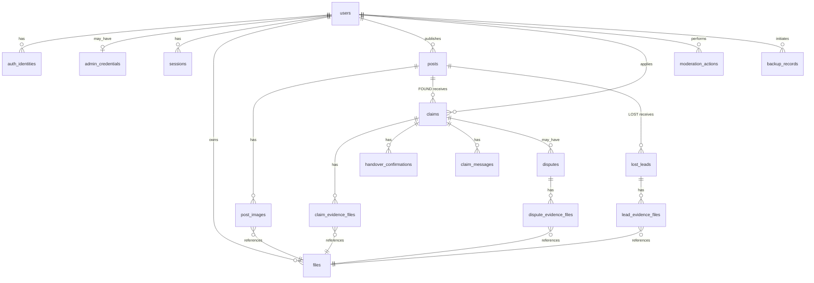

# ER 图与数据字典 (ER Diagram & Data Dictionary)

> 权威 schema 见 `server/src/main/resources/db/migration/V1__baseline.sql`。
> 时间统一 UTC；ID 服务端生成不可枚举；软状态保留而非普通用户硬删除。

## 1. ER 图

## 2. 核心实体数据字典（摘要）

| 表 | 关键字段 | 约束/隐私 |
|---|---|---|
| `users` | nickname, campus, status, campus_verification_status | 认证默认 UNVERIFIED；字段最小化 |
| `auth_identities` | provider, provider_subject | `(provider,provider_subject)` 唯一；微信标识不进公开响应 |
| `admin_credentials` | username, password_hash | BCrypt；禁明文/弱口令 |
| `sessions` | token_hash, expires_at, revoked_at | 不存明文令牌 |
| `posts` | type, title, category, event_location, event_time, published_at, status, version | 索引 `(status,type,category,event_time)`、`(publisher_id,created_at)`；事件时间≠发布时间；乐观锁 version |
| `post_images` | post_id, file_id, sort_order | 仅公开图片；数量受限 |
| `files` | owner_id, purpose, storage_key, visibility, bound | purpose 受控；storage_key 不可构造；孤儿清理 |
| `claims` | post_id, applicant_id, description, status, version + 生成列 | 仅 FOUND；`uk_claim_active_handover`、`uk_claim_active_applicant` |
| `claim_evidence_files` | claim_id, file_id | 仅本人/发布者/授权争议管理员可读 |
| `handover_confirmations` | claim_id, confirmed_by | `(claim_id,confirmed_by)` 唯一；confirmed_by 属申请双方 |
| `claim_messages` | claim_id, sender_id, body, read_at | 仅双方可访问；长度限制 |
| `lost_leads` | lost_post_id, reporter_id, body, status | 仅 LOST；私密线索不进公开搜索 |
| `lead_evidence_files` | lead_id, file_id | 仅相关人可见 |
| `disputes` | claim_id, raised_by, status, resolution_type + 生成列 | `uk_dispute_open`；OPEN 冻结交接；仅授权管理员裁决 |
| `dispute_evidence_files` | dispute_id, file_id, uploaded_by | 严格受限，禁静态直链 |
| `moderation_actions` | admin_id, target_type/id, action, before/after_state | 持久化不可静默覆盖 |
| `audit_logs` | actor, action, target, request_id, result, metadata(JSON) | 仅必要元数据，不含完整私密证明 |
| `backup_records` | initiated_by, status, manifest_path, checksum, restore_verified_at | 备份+恢复验证记录 |
| `idempotency_records` | actor_id, operation, request_key(唯一) | 过期清理 |

## 3. 索引（热点查询）

| 查询 | 索引 |
|---|---|
| 公开列表 | `posts(status, type, category, event_time)` |
| 我的发布 | `posts(publisher_id, created_at)` |
| 收到申请 | `claims(post_id, status)` |
| 我的申请 | `claims(applicant_id, created_at)` |
| 未决争议 | `disputes(claim_id, status)` + `uk_dispute_open` |

## 4. 完整性与隐私规则
- 外键与索引全部写入迁移文件；演进只新增 `Vx` 迁移，不回改历史。
- 公开描述与私密证明**分表存储**；私密文件经鉴权下载代理访问。
- 恢复脚本仅操作**独立空白测试库与文件目录**，默认拒绝生产连接地址（见 `../operations/backup-restore.md`，P4 补全）。
