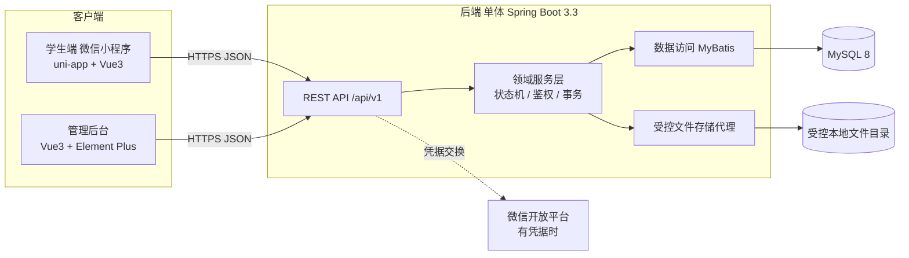

# 架构总览 (Architecture Overview)

## 1. 系统上下文

## 2. 分层与模块边界

- **表现层（Controller）**：仅做参数绑定、鉴权入口、DTO 校验、调用服务、封装 `ApiResponse`。**禁止**在控制器写 SQL 或状态转换。
- **领域服务层（Service）**：业务规则、状态机、资源级授权、事务边界。跨模块写操作的事务所有者见下表。
- **数据访问层（Mapper/MyBatis）**：SQL 与映射；并发不变量用条件更新 / 唯一约束 / 行锁实现。
- **公共层（common）**：统一响应、异常处理、错误码、鉴权上下文、分页、时间/时区工具。

服务端按业务包组织：`auth / user / admin / post / search / match / claim / handover / message / lead / dispute / file / audit / backup / common`。

## 3. 模块与负责人

| 模块 | 负责人 | 后端包 | 前端 |
|---|---|---|---|
| M1 用户与身份 | A | auth, user | 小程序 我的/登录；后台 登录 |
| M2 后台治理与维护 | A | admin, audit, backup | 后台 信息/用户/审计/维护 |
| M3 发布与浏览 | B | post, file | 小程序 首页/详情/发布 |
| M4 检索与匹配 | B | search, match | 小程序 搜索/匹配候选 |
| M5 认领与交接 | C | claim, handover | 小程序 认领/申请详情/交接 |
| M6 沟通与争议 | C | message, lead, dispute | 小程序 留言/线索/争议；后台 争议处理 |

## 4. 跨模块事务所有者（关键一致性契约）

| 业务动作 | 事务所有者 | 触及的其他模块 | 不变量 |
|---|---|---|---|
| 接受认领 | M5 | M3(发布状态) | 锁父发布；单活跃交接唯一；其他待审申请→CLOSED |
| 双方确认齐全→完成 | M5 | M3(发布状态) | 两方确认且无 OPEN 争议才 COMPLETED |
| 发起/裁决争议 | M6 | M5(交接暂停/恢复) | OPEN 争议派生暂停；裁决同步申请/发布状态 |
| 下架/恢复 | M2 | M3/M5(关联处置) | 保留下架前状态；不擅自重置为 ACTIVE |
| 发布状态推进 | M3 | — | C 只能通过 M3 领域服务接口改发布状态 |

> C 调用 B 的发布领域服务推进状态；A 提供统一权限框架与后台布局。跨模块写操作必须在单一事务边界内完成。

## 5. 鉴权模型
- 登录态从安全会话 / Bearer Token 解析用户 ID；**前端传来的 `userId/role/status` 一律不可信**。
- 资源级授权（水平权限）：发布所有者、认领申请双方、争议获授权管理员分别校验。
- 私密对象无权限请求统一返回 404（避免枚举，见 D-12）。
- 管理员权限由后端配置与记录范围控制，不允许前端提升。

## 6. 文件安全
- 上传先落受控存储，记录 `ownerId / purpose / visibility`，绑定业务对象时校验归属与用途。
- 私密文件（PRIVATE_CLAIM/DISPUTE/LEAD）经**带鉴权的下载代理接口**获取，绝不暴露物理路径或永久公开 URL。
- 公开图片（PUBLIC_POST）可走公开读取；孤儿文件有清理策略。

## 7. 相关文档
- 数据模型：`er-diagram.md`
- 状态机与竞态：`state-machines.md`
- 接口契约：`../api/openapi.yaml`、`../api/conventions.md`
- 版本与取舍：`tech-decisions.md`
