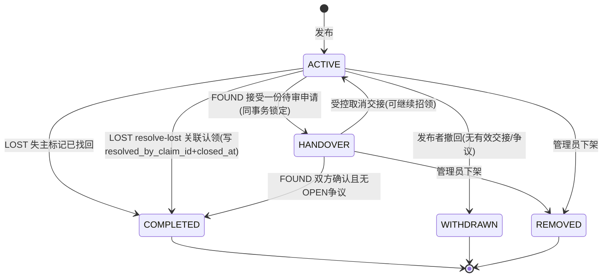
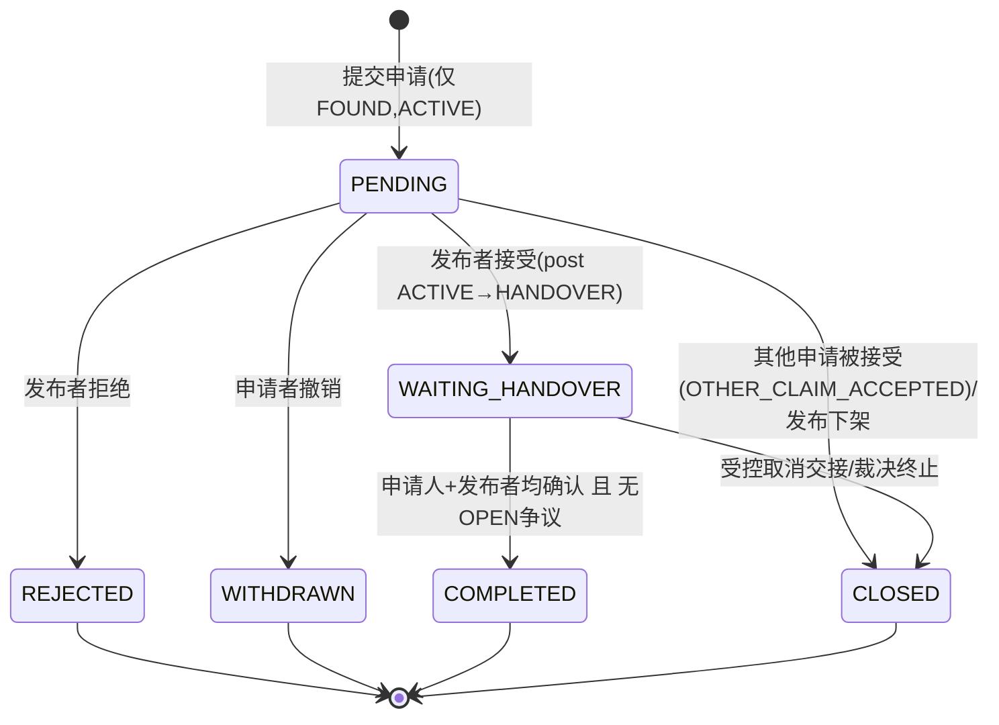
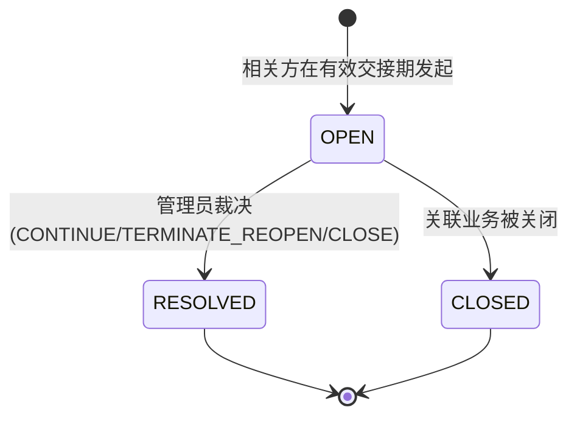
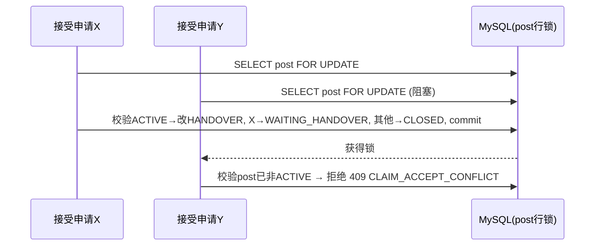

# 状态机与并发一致性 (State Machines & Concurrency)

> 所有状态转换**在服务端强制执行**，禁止任意 `PATCH /status` 绕过业务动作。

## 1. 发布信息状态 (PostStatus)

`PostType = LOST | FOUND`
`PostStatus = ACTIVE | HANDOVER | COMPLETED | WITHDRAWN | REMOVED`
`COMPLETED` 前端名称：LOST=已找回，FOUND=已归还。**LOST 不进入 HANDOVER。**

| 当前 | 动作 | 下一状态 | 执行人 / 约束 |
|---|---|---|---|
| ACTIVE, LOST | 确认已找回 | COMPLETED | 发布者；保留线索 |
| ACTIVE, LOST | resolve-lost：申请人确认关联认领 | COMPLETED | 申请人（=失主）；事务内 lockById+条件更新，写 resolved_by_claim_id + closed_at（V4 闭环，硬校验=本人+ACTIVE+类别一致） |
| ACTIVE, FOUND | 接受待审申请 | HANDOVER | 发布者；同事务锁定物品+唯一交接 |
| HANDOVER, FOUND | 双方确认且无 OPEN 争议 | COMPLETED | 服务端自动归并 |
| HANDOVER, FOUND | 受控取消交接 | ACTIVE 或依裁决关闭 | 明确业务动作；原申请留终止记录 |
| ACTIVE | 撤回 | WITHDRAWN | 无有效交接/争议 |
| 可治理状态 | 管理员下架 | REMOVED | 保留原状态/原因 |

> 下架恢复：审计保存下架前状态并检查关联申请/争议，**不**一律重置为 ACTIVE。

## 2. 认领申请状态 (ClaimStatus)

`ClaimStatus = PENDING | WAITING_HANDOVER | COMPLETED | REJECTED | WITHDRAWN | CLOSED`

- `PENDING → WAITING_HANDOVER`：发布者接受，发布 `ACTIVE→HANDOVER`；其他待审申请同事务 `→CLOSED(OTHER_CLAIM_ACCEPTED)`。
- `WAITING_HANDOVER → COMPLETED`：仅当**申请人确认 + 发布者确认 + 无 OPEN 争议**；发布同事务 `HANDOVER→COMPLETED`。
- `WAITING_HANDOVER → CLOSED`：受控取消或裁决终止；若仍可招领，发布恢复 ACTIVE；历史不覆盖。
- 任何终态申请不可再审核/确认/恢复。

## 3. 争议状态 (DisputeStatus)

`DisputeStatus = OPEN | RESOLVED | CLOSED`；业务**暂停**由"存在 OPEN 争议"派生（单一真相来源）。

| 裁决 resolutionType | 效果 |
|---|---|
| CONTINUE | 恢复交接，回到双方确认流程 |
| TERMINATE_REOPEN | 关闭本次交接；招领若可继续则恢复 ACTIVE |
| CLOSE | 关闭处理，按裁决处置招领 |

## 4. 并发不变量与实现方案

| 不变量 | 实现 |
|---|---|
| 同一 FOUND 招领至多一个 `WAITING_HANDOVER` | `claims.active_handover_key` 生成列 + 唯一索引 `uk_claim_active_handover`，配合**锁定父发布记录**（`SELECT ... FOR UPDATE`）后条件更新 |
| 同一用户对同一招领至多一个有效(PENDING/WAITING_HANDOVER)申请 | `claims.active_applicant_key` 生成列 + 唯一索引 `uk_claim_active_applicant` |
| 一个 claim 至多一个 OPEN 争议 | `disputes.open_dispute_key` 生成列 + 唯一索引 `uk_dispute_open` |
| 重复交接确认幂等 | `handover_confirmations` 唯一键 `(claim_id, confirmed_by)` |
| 最后一方确认 vs 争议创建 竞态 | 二者都先锁定同一父发布/申请行，串行仲裁：完成前重新校验"无 OPEN 争议" |

### 关键时序：并发接受两个申请

> 关键并发场景必须用**真实 MySQL**（或行为等价容器）测试，不得用 Mock 仓储冒充（TC-CLAIM-03 / TC-HANDOVER-02 / TC-DISPUTE-01）。

## 终审并发实现约束

认领提交、帖子撤回/编辑/治理共享帖子行锁；认领审核/撤回/确认/取消/寻物关联遵守帖子→申请锁顺序。发起争议与assign/resolve遵守同一帖子→申请→争议锁序。写事务使用READ_COMMITTED，锁后重读最新状态、确认记录及OPEN争议。双向确认不得停留WAITING_HANDOVER；完成与OPEN争议互斥。线索审核先锁父帖再锁线索，并以旧状态条件更新。真实MySQL反例回归见FinalAcceptanceIT，不能用顺序用例代替并发证明。
